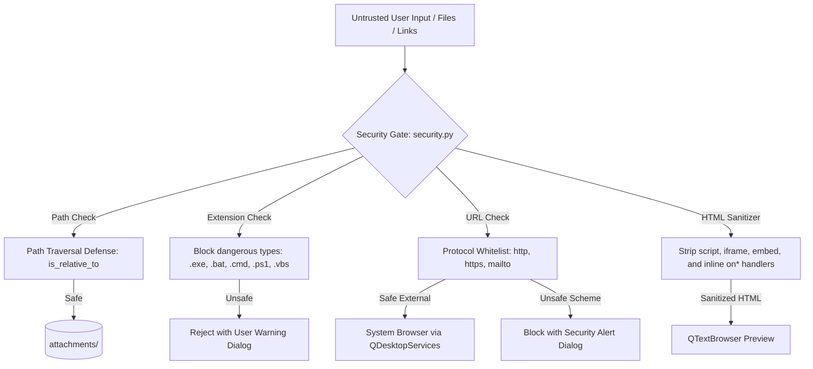
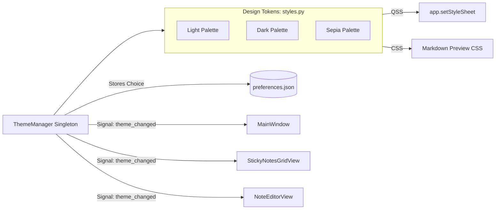

# Sticky Notes - System Architecture & Technical Documentation

This document provides a comprehensive technical overview of the system architecture, component hierarchies, data flows, database schemas, module API references, DevSecOps gates, internationalization (i18n), and mobile strategy for **Danielle's Sticky Notes (v1.7.1)**.

---

## 1. System Architecture

The application is built on a decoupled, modular architecture powered by **PySide6 (Qt 6 for Python)**, an embedded local **SQLite** storage engine, and a detached **Windows Process Lifecycle Manager** for self-updating.

```mermaid
graph TD
    subgraph UILayer [UI Layer (PySide6 / WinUI 3 Fluent)]
        MW[MainWindow - Single-Window Host]
        SW[QStackedWidget - Primary View Router]
        
        GV[StickyNotesGridView]
        NC[NoteCard Widget]
        SC[StackCard - 3D Paper Stack Widget]
        CPF[ColorPickerFlyout]
        TSP[TagSidePanel - Collapsible Filter]
        TSF[TagSelectorFlyout]
        
        EV[NoteEditorView - 3 Modes]
        FT[FormatToolbar]
        PE_UI[SpellCheckUnderline & Suggestion Menu]
        
        UD[UpdateDialog - 7-Page Stack]
        SD[ShareNoteDialog & DraggableNoteChip]
        SRD[ScreenRecorderDialog & SnippingOverlay]
        VRD[VoiceRecorderDialog]
        PD[ProjectDialog]
        HD[HelpDialog]
    end

    subgraph ServiceLayer [Service & Subsystem Layer]
        UPD[updater.py - Multi-Tier Feed & Self-Restart]
        PE[proofing_engine.py - Spell Checking Engine]
        I18N[i18n.py - Bilingual Runtime Switcher]
        MM[media_manager.py - WASAPI & Screen Recorder]
        TM[theme_manager.py - Windows Dark Mode Sync]
        SEC[security.py - Path & HTML Sanitization Gate]
        ICO[icons.py - Themed SVG Renderer]
    end

    subgraph StorageLayer [Local Persistence Layer]
        DB[(SQLite Engine: notes.db)]
        FS_ATT[(Local Media: %LOCALAPPDATA%/StickyNotes/attachments/)]
        PREF[(User Preferences: preferences.json)]
        TEMP[(Update Staging: %TEMP%/StickyNotes_Update/)]
    end

    MW --> SW
    SW -->|Index 0| GV
    SW -->|Index 1| EV
    
    GV --> NC
    GV --> SC
    NC --> CPF
    NC --> TSF
    GV --> TSP
    
    EV --> FT
    EV --> PE_UI
    
    MW --> UD
    MW --> SD
    MW --> SRD
    MW --> VRD
    MW --> PD
    MW --> HD

    UD --> UPD
    UPD -->|Staging & Script| TEMP
    EV --> PE
    PE -->|User Words| DB
    
    GV --> I18N
    EV --> I18N
    
    SRD --> MM
    VRD --> MM
    MM --> FS_ATT
    
    MW --> TM
    TM --> PREF
    
    GV --> SEC
    EV --> SEC
    
    GV -->|CRUD Queries| DB
    EV -->|Auto-save / Fetch| DB
```

---

## 2. Component Hierarchy & Navigation Flow

The application strictly implements a **single-window host design pattern** (`MainWindow`) to prevent desktop window clutter and multiple taskbar icons:

1. **`MainWindow` (`QMainWindow`)**:
   - Contains a root `QStackedWidget` managing two primary application views:
     - **Index 0:** `StickyNotesGridView` (Card grid, 3D note stacks, project bar, search, and collapsible tag sidebar).
     - **Index 1:** `NoteEditorView` (Document workspace with Markdown formatting, proofing squiggles, and media embedding).
   - Manages top-level modal dialogs: `UpdateDialog`, `ShareNoteDialog`, `ScreenRecorderDialog`, `ProjectDialog`, `HelpDialog`.
   - Listens to Windows OS events for native dark mode switching (`WM_THEMECHANGED` and `colorSchemeChanged`).

2. **`StickyNotesGridView` (`QWidget`)**:
   - Manages notes in a responsive adaptive grid.
   - Displays standalone notes via `NoteCard` and grouped project notes via `StackCard` (3D layered paper stack cards).
   - Supports drag-and-drop merging of notes into projects.
   - Hosts `TagSidePanel` (collapsible left drawer) and `ColorPickerFlyout`.
   - Real-time search by title, markdown content, color filter chips, and tag filter chips.

3. **`NoteEditorView` (`QWidget`)**:
   - Split-screen or full-screen editor supporting three modes: `Edit`, `Split`, and `Preview`.
   - Integrates `FormatToolbar` for text manipulation and media attachments.
   - Integrates `ProofingEngine` displaying red wavy squiggles for misspelled words with right-click corrections.
   - Automatic debounced auto-saving (600ms inactivity timer) and instant save upon clicking the return arrow (`←`).

---

## 3. Data Schema & Persistence Model

### SQLite Schema (`notes.db`)

The database consists of **4 normalized tables** with automatic schema migration:

```sql
-- 1. Notes Table
CREATE TABLE IF NOT EXISTS notes (
    id TEXT PRIMARY KEY,                       -- UUID v4 string
    title TEXT NOT NULL,                       -- Note title (UTF-8)
    content TEXT NOT NULL,                     -- Raw Markdown content
    color_hex TEXT NOT NULL,                   -- Card accent color (e.g. #FFF9C4)
    project_id TEXT DEFAULT 'default',         -- Foreign key to projects.id
    tags TEXT DEFAULT '[]',                    -- JSON serialized list of tag strings
    created_at TEXT NOT NULL,                  -- ISO-8601 UTC timestamp
    updated_at TEXT NOT NULL                   -- ISO-8601 UTC timestamp
);

CREATE INDEX IF NOT EXISTS idx_notes_updated_at ON notes(updated_at DESC);
CREATE INDEX IF NOT EXISTS idx_notes_project_id ON notes(project_id);

-- 2. Projects Table (v1.6.3)
CREATE TABLE IF NOT EXISTS projects (
    id TEXT PRIMARY KEY,                       -- Unique project slug or UUID
    name TEXT NOT NULL,                        -- Project display name
    color_hex TEXT DEFAULT '#2563EB',          -- Project theme accent color
    icon TEXT DEFAULT 'folder',                -- Project icon identifier
    created_at TEXT NOT NULL,                  -- ISO-8601 UTC timestamp
    updated_at TEXT NOT NULL                   -- ISO-8601 UTC timestamp
);

-- 3. Custom Tags Table (v1.6.4)
CREATE TABLE IF NOT EXISTS custom_tags (
    id TEXT PRIMARY KEY,                       -- Tag slug/identifier
    name TEXT NOT NULL UNIQUE,                 -- Clean tag name (without '#')
    color_hex TEXT DEFAULT '#64748B',          -- Tag badge color
    created_at TEXT NOT NULL                   -- ISO-8601 UTC timestamp
);

-- 4. User Dictionary Table (v1.6.5)
CREATE TABLE IF NOT EXISTS user_dictionary (
    word TEXT PRIMARY KEY,                     -- Lowercase accepted custom word
    language TEXT NOT NULL,                    -- Language code ('en' or 'es')
    created_at TEXT NOT NULL                   -- ISO-8601 UTC timestamp
);
```

### Storage Location Strategy
* **Development Mode:** Stored locally in the workspace directory (`./notes.db` and `./attachments/`).
* **Standalone Frozen Executable:** Automatically redirects storage to `%LOCALAPPDATA%\StickyNotes\` on Windows (or platform standards) to guarantee write permissions and prevent data loss across updates.

---

## 4. Subsystem Reference

### 🔄 Auto-Update Subsystem (`updater.py` & `components/update_dialog.py`)
- **Multi-Tier Feed Resolution:**
  1. *Tier 1:* Public Releases Mirror API (`PUBLIC_MIRROR_API_URL`) - Instant, uncached, zero-token.
  2. *Tier 2:* Cache-busted raw manifest (`version.json?nocache=timestamp`).
  3. *Tier 3:* Direct GitHub API (`api.github.com`) using optional stored PAT for private repos.
  4. *Tier 4:* Custom user mirror URL.
- **`NoAuthRedirectHandler`:** Custom `urllib.request.HTTPRedirectHandler` that strips `Authorization` headers when GitHub redirects to AWS S3 storage, preventing S3 HTTP 400 Bad Request errors.
- **Binary Integrity Verification:** Validates minimum size (>100KB), `b"MZ"` executable headers for `.exe`, and `b"PK"` headers for `.zip`.
- **Detached Self-Restart (`apply_update_and_restart`):**
  - Writes a hardened batch script to `%TEMP%\StickyNotes_Update\apply_update.bat`.
  - Launches via `subprocess.Popen` with `stdin/stdout/stderr=subprocess.DEVNULL` and `DETACHED_PROCESS | CREATE_NEW_PROCESS_GROUP`.
  - Executes Inno Setup silent install with `/SILENT /NORESTART /CLOSEAPPLICATIONS /DIR="{app_dir}"`.
  - Logs full diagnostics with timestamps to `%TEMP%\StickyNotes_Update\update.log`.
  - Relies on a 0.5s grace period before `sys.exit(0)` to prevent process shutdown race conditions.

### 📤 Windows Native Sharing Subsystem (`components/share_dialog.py`)
- **`invoke_windows_share_ui(file_paths, parent_hwnd)`:** Invokes the official Windows 10/11 system Share flyout using the native Windows Shell `&Share` COM verb via `win32com.client.Dispatch("Shell.Application")`.
- **`invoke_windows_open_with(file_path)`:** Invokes the Windows "Open With" app chooser dialog via `rundll32.exe shell32.dll,OpenAs_RunDLL`.
- **Desktop URI Protocol Handlers:** Native desktop protocol invocation (`whatsapp://send?text=`, `tg://msg?text=`, `msteams:/l/chat/`, `sms:?body=`, `mailto:`).
- **`DraggableNoteChip`:** Custom interactive drag-and-drop chip that populates `QMimeData` with `text/plain`, `text/html`, and `text/uri-list` pointing to a staged `.zip` note package.
- **Rich Clipboard Export:** Synthesizes multi-format clipboard content (formatted HTML, plain text, and rendered note bitmap).

### 🎥 Screen & 2-Way Audio Recording Subsystem (`media_manager.py` & `components/screen_recorder_dialog.py`)
- **Multi-Monitor Snipping HUD:** Full-screen translucent overlay spanning all virtual desktop geometry (`QGuiApplication.screens()`) with crosshair cursor, rubberband selection, and live coordinate display.
- **WASAPI Audio Loopback (2-Way Capture):** Captures speaker output (meeting calls, remote audio) and microphone simultaneously via `pyaudiowpatch`.
- **Audio Mixing Engine:** Mixes dual audio streams into unified synchronized channels using `numpy` arrays and pure Python WAV channel interleaving as a fallback when FFmpeg is not installed.
- **Video Assembly:** Transcodes captured video frames and audio to H.264 MP4 via FFmpeg.

### ✍️ Proofing Engine (`proofing_engine.py`)
- **Live Spell Checking:** Tokenizes Markdown text into alphanumeric words and evaluates spelling via `pyspellchecker`.
- **Custom SQLite Dictionary:** Integrates with `user_dictionary` table to allow users to add custom technical jargon, names, or acronyms to their personal dictionary.
- **Bilingual Proofing:** Dynamically swaps spell checking dictionaries between English (`en`) and Spanish (`es`) based on the active runtime language.

### 🌐 Bilingual Engine (`i18n.py`)
- **Runtime Dictionary:** Dictionary-based translation mapping for all application labels, buttons, tooltips, and dialog messages.
- **Canonical Tag Translation:** System tags (`#work`, `#personal`, `#urgent`, `#ideas`, `#todo`) are dynamically localized in the UI while stored in canonical English format in SQLite.
- **Preference Persistence:** Active language (`"en"` or `"es"`) is saved in `preferences.json` and loaded on startup.

---

## 5. Security & DevSecOps Architecture



### Security Defenses Implemented:
1. **Strict Path Containment:** Every media attachment copied via `media_manager.copy_to_attachments()` is checked against `Path.resolve().is_relative_to(get_attachments_dir().resolve())`. Traversal attempts (`../../`) raise `PermissionError`.
2. **Dangerous Filetype Blocking:** Attachments matching `.exe`, `.bat`, `.cmd`, `.ps1`, `.vbs`, `.sh`, `.scr`, `.msi`, `.dll`, or hidden double extensions (e.g. `invoice.pdf.exe`) are rejected before disk writes occur.
3. **URL Protocol Whitelisting:** External links clicked in `NoteEditorView` are evaluated with `is_safe_url()`. Only `http://`, `https://`, `mailto:`, or local attachments within the app's `attachments/` directory are permitted. Dangerous schemes (`javascript:`, `shell:`, `powershell:`) are blocked.
4. **Markdown Preview HTML Sanitization:** Raw or generated HTML is processed through `sanitize_markdown_html()` to strip active `<script>` tags, malicious frames, embeds, and JavaScript event handlers (`onload`, `onerror`, `onclick`).
5. **100% Parameterized SQLite Engine:** All database queries use parameterized placeholders (`?`). AST static analysis (`scripts/security_check.py`) audits the codebase to guarantee no dynamic SQL construction via f-strings exists.

---

## 6. Theme Architecture & Design Tokens System

The application features a centralized, tokenized theme architecture decoupled from individual Qt widgets:



* **`theme_manager.py` (ThemeManager):** Singleton managing active theme state (`"light"`, `"dark"`, `"sepia"`). Listens to Windows `WM_THEMECHANGED` messages and Qt `colorSchemeChanged` events to match system dark mode automatically.
* **`styles.py` (Design Tokens):** Tokenized palettes defining background, surface, text, border, and accent colors for each theme. `generate_app_stylesheet(theme)` compiles standard QSS rules.

---

## 7. Mobile Strategy: Android & iOS Portability

Desktop platforms (Windows, macOS, Linux) share 95% of PySide6 code directly. Mobile platforms follow a decoupled client architecture:

```
┌────────────────────────────────────────────────────────┐
│             Desktop (Win/Mac/Linux)                    │
│            PySide6 (Qt6) + SQLite                      │
└────────────────────────────────────────────────────────┘
                           ▲
                           │ Shared Database Schema & API
                           ▼
┌────────────────────────────────────────────────────────┐
│             Mobile Target (Android / iOS)              │
│                                                        │
│  Option A (Recommended): Flutter or React Native       │
│  - Native 120Hz touch animations                       │
│  - Seamless mobile camera & microphone access          │
│  - Shares SQLite schema & Markdown parser              │
│                                                        │
│  Option B: Web PWA (Progressive Web App)               │
│  - Write once in modern web tech                       │
│  - Runs in Chrome on Android / Safari on iOS           │
└────────────────────────────────────────────────────────┘
```
