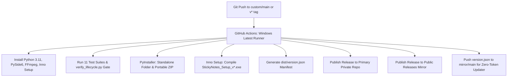

# Professional Development Lifecycle & Documentation Governance

This document establishes the official engineering standards, documentation governance, versioning policy, and release lifecycle for the **Sticky Notes** project.

---

## 1. Documentation Governance (Documentation-as-Code)

Documentation is considered a first-class engineering artifact equal in importance to source code.

### Core Rules:
1. **Atomic Documentation Updates:** Every code commit that introduces a new feature, changes an API signature, alters database schemas, or changes UI workflows **MUST** include updates to the corresponding documentation files (`docs/ARCHITECTURE.md`, `docs/ROADMAP.md`, `README.md`, or component docstrings) in the **same commit**.
2. **No Undocumented Public APIs:** Every class, method, function, and database query must feature explicit Python type hints and clean PEP-257 docstrings explaining parameters, return types, and side effects.
3. **Living Architectural Spec:** When internal data structures, dependencies, or media storage pathways change, `docs/ARCHITECTURE.md` must be updated to reflect current state.
4. **Enforcement:** The verification script (`scripts/verify_lifecycle.py`) automatically checks documentation integrity before any release.

---

## 2. Versioning Policy (Semantic Versioning 2.0.0)

All releases adhere strictly to [Semantic Versioning (SemVer 2.0.0)](https://semver.org/):

$$\text{Format: } \text{MAJOR}.\text{MINOR}.\text{PATCH}$$

* **`MAJOR` (e.g., 2.0.0):**
  * Incompatible database schema migrations requiring manual data conversions.
  * Major UI paradigm shifts or full cross-platform mobile app launches (Android/iOS).
  * Breaking changes to CLI or export file formats.
* **`MINOR` (e.g., 1.3.0):**
  * New, backward-compatible features (e.g., instant search bar, hashtag filtering, language localization packs, new export format).
  * Non-breaking database enhancements (e.g., new optional columns with defaults).
* **`PATCH` (e.g., 1.2.1):**
  * Backward-compatible bug fixes and stability enhancements.
  * UI polish, font adjustments, and performance optimizations.
  * Test suite expansions and documentation revisions.

### Single Source of Truth
* All version numbers are defined exclusively in **`version.py`** (`__version__`).
* `main.py`, `build_exe.py`, test suites, and packaging scripts import dynamically from `version.py`. Manual hardcoding of version strings in other files is prohibited.

---

## 3. Git Workflow & Conventional Commits

### Branching Model
* **`main`**: Production-ready, stable codebase. Always builds and passes all tests.
* **`feature/<feature-name>`**: Development branch for new capabilities (e.g., `feature/instant-search`).
* **`fix/<bug-name>`**: Bug fix branch (e.g., `fix/microphone-null-guard`).
* **`release/vX.Y.Z`**: Preparation branch for version bumps, changelog finalization, and packaging.

### Commit Message Standard (Conventional Commits)
All commit messages must follow the [Conventional Commits](https://www.conventionalcommits.org/) format:

```
<type>(<optional scope>): <short imperative description>

[optional body]

[optional footer(s)]
```

#### Allowed Types:
* **`feat`**: A new user-facing feature or enhancement.
* **`fix`**: A bug fix.
* **`docs`**: Documentation updates or additions only.
* **`test`**: Adding, refactoring, or repairing tests.
* **`refactor`**: Code changes that neither fix a bug nor add a feature.
* **`style`**: Changes that do not affect code meaning (white-space, formatting, semicolons).
* **`chore`**: Build process, packaging script, or dependency maintenance.

*Example:* `feat(toolbar): add one-click bold, italic, and underline buttons`

---

## 4. The 6-Stage Development Lifecycle Gate

Every proposed change passes through six sequential validation stages:

```
┌────────────────────────────────────────────────────────┐
│ Stage 1: Specification & RFC                          │
│ - Define user stories and architectural impact         │
└────────────────────────────────────────────────────────┘
                           │
                           ▼
┌────────────────────────────────────────────────────────┐
│ Stage 2: Implementation & Typing                       │
│ - Write clean, modular Python with type annotations    │
└────────────────────────────────────────────────────────┘
                           │
                           ▼
┌────────────────────────────────────────────────────────┐
│ Stage 3: Automated Test Verification                   │
│ - 11 automated test suites execute with 0 failures     │
└────────────────────────────────────────────────────────┘
                           │
                           ▼
┌────────────────────────────────────────────────────────┐
│ Stage 4: DevSecOps & Security Audit Gate               │
│ - Path traversal, SQLi tests, AST SAST scanner pass    │
└────────────────────────────────────────────────────────┘
                           │
                           ▼
┌────────────────────────────────────────────────────────┐
│ Stage 5: Documentation-as-Code Synchronization         │
│ - Update ARCHITECTURE.md, README.md, and CHANGELOG.md  │
└────────────────────────────────────────────────────────┘
                           │
                           ▼
┌────────────────────────────────────────────────────────┐
│ Stage 6: Version Bump, Packaging & Release Sync        │
│ - Bump version.py, build Inno Setup installer & tag    │
└────────────────────────────────────────────────────────┘
```

---

## 5. Automated CI/CD Pipeline & Dual-Repo Release Distribution

The project automates builds, installer compilation, and releases via GitHub Actions (`.github/workflows/build.yml`):



### Key Release Artifacts:
1. `StickyNotes_Setup_v{version}.exe`: Windows installer with desktop shortcut, Start Menu entry, clean uninstaller, and silent update execution.
2. `StickyNotes_v{version}_Windows.zip`: Standalone portable package with embedded dependencies and bundled FFmpeg.
3. `version.json`: JSON manifest powering the in-app auto-updater's zero-token public feed.

---

## 6. The "Definition of Done" (DoD) Checklist

A feature is considered **Done** and ready for production only when all boxes are checked:

* [ ] **Code Implementation:** Clean, modular code adhering to PEP 8 standards with full type annotations.
* [ ] **Automated Testing:** Dedicated test cases written in `tests/` and verified with `0` failures across all 11 test suites.
* [ ] **Security Verification:** `tests/test_security.py` passes 100% and AST scanner (`scripts/security_check.py`) finds 0 high/critical violations.
* [ ] **Cross-Platform Safety:** Paths use `pathlib.Path` or Qt standard paths (no hardcoded OS-specific backslashes).
* [ ] **Documentation Sync:** `README.md`, `docs/ARCHITECTURE.md`, and `docs/ROADMAP.md` updated to reflect the change.
* [ ] **Changelog Logged:** Detailed changes recorded under the target version in `CHANGELOG.md`.
* [ ] **Version Alignment:** `version.py` and `installer.iss` match the target milestone.
* [ ] **Release Manifest:** `version.json` updated with corresponding release URLs and hashes.
* [ ] **Lifecycle Verification:** `python scripts/verify_lifecycle.py` runs with a `[LIFECYCLE PASSED]` exit code.

